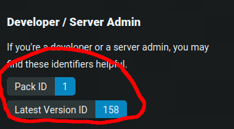

# FTB Pack Downloader

This is a simple script to download modpacks from FTB without the need of the FTB Launcher.

To use this script, first head to the FTB modpack page and get the id of the modpack you want to download. To find this scroll down to the section on the right that says "Developer / Server Admin".



Once you have the id run the python script. It will ask for the pack id and the version id. Once you have entered these it will download the modpack and create a zip file with the modpack name.

You can then import this zip file into any curseforge compatible launcher.

This has been tested with FTB Academy imported into Prism Launcher.

## Notes

This script is a very quick and dirty script and is not very user friendly. It is also not very robust and will likely break multiple times. It is also not very efficient, It is also not very well tested and will not work for all modpacks.

If you would like to improve this script, feel free to make a pull request.

## Usage

```bash
    git clone https://github.com/Lutitious/ftb-downloader.git
    cd ftb-downloader
    python3 main.py
```